<p align="center">
  
</p>

<h1 align="center">Anedolia</h1>

<p align="center">
  <em>A narrative web game about rediscovering color in life through memories</em>
</p>

<p align="center">
  
  
  
  
  
  
</p>

<p align="center">
  <a href="#-about">About</a> •
  <a href="#-features">Features</a> •
  <a href="#-installation">Installation</a> •
  <a href="#-architecture">Architecture</a> •
  <a href="#-how-it-works">How It Works</a> •
  <a href="#-gemini-integration">Gemini Integration</a>
</p>

---

## 📖 About

**Anedolia** is an immersive first-person narrative experience where players navigate through a grayscale apartment, interacting with everyday objects that unlock forgotten memories. As the story unfolds, color gradually returns to the world — transforming from muted grays to soft pastels, and finally to vibrant, saturated tones — culminating in a hopeful and emotionally resonant ending.

The game explores profound themes of **emotional numbness**, **routine**, and **recovery**, drawing inspiration from acclaimed titles like **LIMBO**, **INSIDE**, and **Journey**. What makes Anedolia unique is that all narrative content — internal monologues, memory descriptions, and the final emotional message — is **dynamically generated by Google's Gemini API**, ensuring each playthrough feels personal and distinct.

**Built for the Google Gemini API Developer Competition.**

### 🎯 Core Themes
- 🧠 **Mental Health** — Exploring depression and emotional detachment
- 🔄 **Routine & Monotony** — The weight of living on autopilot
- 💡 **Awareness** — Rediscovering meaning through small moments
- 🌈 **Hope** — Visual metaphor of color returning to life

---

## ✨ Features

### 🎮 Gameplay
- **Immersive 3D Environment** — Fully explorable apartment with realistic physics
- **Third-Person Camera** — Smooth, cinematic camera controls
- **Interactive Objects** — 5+ meaningful objects with unique narratives
- **Progressive Color System** — World transitions from grayscale to full color
- **Proximity-Based Interactions** — Context-sensitive UI prompts

### 🤖 AI-Powered Narrative
- **Dynamic Story Generation** — Unique texts created by Gemini API
- **Contextual Responses** — Poetic descriptions tailored to game themes
- **Fallback System** — Offline-ready with pre-written content
- **Multi-Stage Experience** — Intro → Wake-up → Exploration → Ending

### 🎨 Visual & Audio
- **Post-Processing Effects** — Custom shaders for color progression
- **Character Animations** — Idle, walking, sitting-to-standing sequences
- **Ambient Soundscapes** — Interaction audio feedback
- **Cinematic Sequences** — Narrative intro and emotional conclusion

### ⚡ Technical
- **Hexagonal Architecture** — Clean separation between domain, adapters and UI
- **WebGL-Based** — Runs directly in browser, no downloads
- **Optimized Performance** — Maintains 60fps on modern browsers
- **Responsive Design** — Works across devices
- **Server-Side API** — Secure Gemini API key handling

---

## 🚀 Tech Stack

| Category | Technologies |
|----------|-------------|
| **Framework** | Next.js 16, React 18, TypeScript |
| **3D Rendering** | React Three Fiber, Three.js, @react-three/drei |
| **Physics** | @react-three/rapier (Rapier physics engine) |
| **AI** | Google Gemini API (gemini-1.5-flash) |
| **State Management** | Zustand, React Hooks |
| **Styling** | Tailwind CSS |
| **3D Modeling** | Blender (character & environment) |
| **Animation** | GLTF animations, SkeletonUtils |

---

## 📦 Installation

### Prerequisites

Before you begin, ensure you have:

- ✅ **Node.js 18+** ([Download](https://nodejs.org/))
- ✅ **npm** or **yarn**
- ✅ **Google AI Studio API Key** ([Get it here](https://aistudio.google.com/app/apikey))

### Setup Instructions

1. **Clone the repository**
```bash
git clone https://github.com/Sofia-gith/Anedolia.git
cd Anedolia
```

2. **Install dependencies**
```bash
npm install
```

3. **Configure environment variables**

Create a `.env.local` file in the root directory:
```env
GOOGLE_API_KEY=your_gemini_api_key_here
```

> ⚠️ **Security Note:** Never commit your `.env.local` file to version control!

4. **Run the development server**
```bash
npm run dev
```

5. **Open the game**

Navigate to [http://localhost:3000](http://localhost:3000) in your browser.

### Production Build
```bash
npm run build
npm start
```

---

## 🏛️ Architecture

Anedolia follows **Hexagonal Architecture** (also known as Ports & Adapters), ensuring a clean separation between game rules and implementation details.

### The Core Principle

> The domain knows nothing about React, Three.js, Zustand, or the browser.
> Everything depends on the core. The core depends on nothing.

```
components/  →  hooks/  →  core/
     ↓              ↓
   app/page.tsx  ←──┘
```

### Folder Structure

```
/
├── core/                             ← Pure domain (no external dependencies)
│   ├── index.ts                      ← Public API — adapters import from here
│   ├── domain/
│   │   ├── InteractionRules.ts       ← Objects, weights, trigger rules
│   │   ├── ColorProgress.ts          ← Pure progress calculation
│   │   ├── GameSession.ts            ← State machine + session reducers
│   │   └── Narrative.ts              ← Intro slides, object texts, endings
│   └── ports/
│       ├── in/IGameActions.ts        ← Contract: what adapters call
│       └── out/IGameEvents.ts        ← Contract: what the core emits
│
├── app/
│   └── page.tsx                      ← Orchestrator (state machine + render)
│
├── components/                       ← UI Adapters
│   ├── camera/
│   │   ├── CameraThirdPerson.tsx
│   │   └── CameraZoom.tsx
│   ├── effects/
│   │   └── AnedoliaEffects.tsx
│   ├── interaction/
│   │   ├── InteractiveObject.tsx     ← Uses core/InteractionRules + core/Narrative
│   │   └── useInteraction.tsx        ← Zustand store
│   ├── player/
│   │   ├── Player.tsx
│   │   └── Player3D.tsx
│   ├── scene/
│   │   ├── Apartamento.tsx
│   │   ├── Book.tsx
│   │   ├── GameScene.tsx
│   │   └── PictureFrame.tsx
│   ├── sequences/
│   │   ├── EndGameSequence.tsx       ← Uses core/Narrative
│   │   ├── IntroNarrativa.tsx        ← Uses core/Narrative
│   │   └── WakeUpSequence.tsx
│   └── ui/
│       ├── GeminiTextDisplay.tsx
│       └── GenGemini.tsx
│
├── hooks/                            ← State Adapters
│   ├── useGameAudio.ts
│   └── useGameProgress.ts            ← Uses core/InteractionRules + core/ColorProgress
│
└── public/
    ├── endGame/
    ├── images/
    ├── intro/
    ├── models/
    └── songs/
```

### Class Diagram

```mermaid
classDiagram
    direction TB

    namespace Core_Domain {

        class InteractionRules {
            <<domain>>
            +GAME_OBJECTS : Record~ObjectId, ObjectRule~
            +ALL_OBJECT_IDS : ObjectId[]
            +REQUIRED_FOR_ENDING : ObjectId[]
            +TRIGGER_OBJECTS : ObjectId[]
            +isValidObject(id) bool
            +isTriggerObject(id) bool
            +isEndingComplete(interacted) bool
        }

        class ObjectRule {
            <<value object>>
            +displayName : string
            +colorWeight : number
            +requiredForEnding : boolean
            +isTrigger : boolean
        }

        class ColorProgress {
            <<domain>>
            +calculateColorProgress(interacted) number
        }

        class GameSession {
            <<domain>>
            +state : GameState
            +interactedObjects : ObjectId[]
            +colorProgress : number
            +endingTriggered : boolean
            +endingComplete : boolean
            +createInitialSession() GameSession
            +transitionState(session, to) GameSession
            +recordInteraction(session, id) GameSession
            +canTransition(from, to) boolean
        }

        class Narrative {
            <<domain>>
            +INTRO_SLIDES : NarrativeSlide[]
            +OBJECT_TEXTS : Record~ObjectId, string~
            +ENDING_COMPLETE : EndingContent
            +ENDING_INCOMPLETE : EndingContent
            +getEndingContent(isComplete) EndingContent
        }
    }

    namespace Core_Ports {

        class IGameActions {
            <<port in>>
            +advanceState(to) void
            +interact(objectId) void
        }

        class IGameEvents {
            <<port out>>
            +onStateChanged(state) void
            +onObjectInteracted(objectId) void
            +onColorProgressChanged(value) void
            +onEndingTriggered(isComplete) void
            +onModalOpened() void
            +onModalClosed() void
        }
    }

    namespace Adapters_Hooks {

        class useInteraction {
            <<adapter state>>
            +playerPosition : Vec3
            +nearbyObject : NearbyObjectInfo
            +activeInteraction : ActiveInteractionInfo
            +interactedObjects : string[]
            +zoomState : ZoomState
            +setPlayerPosition(pos) void
            +setNearbyObject(obj) void
            +setActiveInteraction(info) void
            +markInteracted(id) void
            +interact(playerPos) void
            +startZoom(...) void
            +endZoom() void
        }

        class useGameProgress {
            <<adapter state>>
            +colorProgress : number
            -endingHandledRef : boolean
            +useGameProgress(options) object
        }

        class useGameAudio {
            <<adapter state>>
            -rainAudioRef : HTMLAudioElement
            -endAudioRef : HTMLAudioElement
            +fadeOutRainAudio() void
            +playEndAudio() void
        }
    }

    namespace Adapters_UI {

        class InteractiveObject {
            <<adapter ui>>
            +objeto : string
            +position : Vec3
            +interactionDistance : number
            +audioPath : string
        }

        class GeminiTextDisplay {
            <<adapter ui>>
        }

        class IntroNarrativa {
            <<adapter ui>>
            +onComplete() void
        }

        class EndGameSequence {
            <<adapter ui>>
            +allInteractionsComplete : boolean
            +onClose() void
        }

        class GameScene {
            <<adapter ui>>
            +colorProgress : number
            +gameState : GameState
            +onWakeUpComplete() void
        }

        class Player3D {
            <<adapter ui>>
            +speed : number
            +runSpeed : number
            +onPositionChange(pos) void
        }
    }

    class GamePage {
        <<orchestrator>>
        +gameState : GameState
        +colorProgress : number
        +showEndGame : boolean
        +allInteractionsComplete : boolean
    }

    InteractionRules "1" *-- "5" ObjectRule : defines
    GameSession ..> InteractionRules : uses
    GameSession ..> ColorProgress : uses
    ColorProgress ..> InteractionRules : reads weights

    IGameActions ..> GameSession : drives
    IGameEvents ..> GameSession : observes

    useGameProgress ..> InteractionRules : isTriggerObject\nisEndingComplete
    useGameProgress ..> ColorProgress : calculateColorProgress
    useGameProgress --> useInteraction : reads interactedObjects

    useGameAudio --> useInteraction : reads activeInteraction

    InteractiveObject ..> InteractionRules : isTriggerObject\nisValidObject
    InteractiveObject ..> Narrative : OBJECT_TEXTS\nGAME_OBJECTS.displayName
    InteractiveObject --> useInteraction : markInteracted\nsetActiveInteraction

    IntroNarrativa ..> Narrative : INTRO_SLIDES
    EndGameSequence ..> Narrative : getEndingContent

    GeminiTextDisplay --> useInteraction : reads nearbyObject\nactiveInteraction

    Player3D --> useInteraction : setPlayerPosition\ninteract

    GamePage --> useGameAudio : fadeOutRainAudio\nplayEndAudio
    GamePage --> useGameProgress : colorProgress
    GamePage --> GameScene : renders
    GamePage --> IntroNarrativa : renders
    GamePage --> EndGameSequence : renders
    GamePage --> GeminiTextDisplay : renders
```



### Why Hexagonal Architecture?

| Concern | Before | After |
|---------|--------|-------|
| Game rules location | Scattered across components and hooks | Centralized in `core/domain/` |
| Adding a new object | Edit 4+ files | Edit only `InteractionRules.ts` + `Narrative.ts` |
| Changing ending logic | Hunt through JSX conditionals | One function in `GameSession.ts` |
| Testing game rules | Requires rendering components | Pure functions, no dependencies |
| Trigger rule (mirror) | `if (objeto === "mirror")` in 3 places | `isTrigger: true` in one place |

---

## 🎮 Game Design

### Core Concept

Players wake up in a **monochromatic world**, experiencing the emotional weight of routine and numbness. Through exploration and interaction with meaningful objects, they gradually **restore color** to their surroundings — a metaphor for rediscovering awareness, presence, and emotional connection.

### Interactive Objects

| Object | Theme | Color Progress |
|--------|-------|----------------|
| ☕ **Coffee Machine** | Morning rituals, warmth | +10% |
| 🌿 **Plant** | Growth, persistence | +15% |
| 📚 **Books** | Knowledge, memories | +20% |
| 🖼️ **Painting** | Creativity, expression | +30% |
| 🪞 **Mirror** | Self-reflection | Ending trigger |

> The mirror is a **trigger**, not a collectible — it ends the game without contributing to color progress. This rule lives in `core/domain/InteractionRules.ts`.

### Controls

| Input | Action |
|-------|--------|
| **W A S D** | Move character |
| **Mouse** | Look around / Rotate camera |
| **E** | Interact with nearby objects |
| **Space** | Run (gameplay) / Advance (intro) |
| **Click** | Lock pointer for camera control |

---

## 🔧 How It Works

### 1. Game State Machine

```typescript
// core/domain/GameSession.ts
type GameState =
  | "intro"        // Narrative slideshow
  | "waking_up"    // Character on bed, waiting for SPACE
  | "standing_up"  // Stand-up animation playing
  | "playing";     // Free exploration
```

Transitions are validated by the core — invalid transitions (e.g. `intro → playing`) are rejected.

### 2. Physics & Collision

- **Player** — Capsule collider prevents clipping through walls
- **Environment** — Trimesh colliders for precise apartment geometry
- **Movement** — Physics-based with lerp smoothing for natural feel

### 3. Camera System

**Third-Person Camera** orbits around the player using yaw/pitch angles with pointer lock and smooth lerp interpolation.

**Zoom System** temporarily overrides player control during interactions with ease-in-out cubic transitions.

### 4. Color Progression

```typescript
// core/domain/ColorProgress.ts
export function calculateColorProgress(interacted: ObjectId[]): number {
  const total = interacted.reduce(
    (acc, id) => acc + GAME_OBJECTS[id].colorWeight, 0
  );
  return Math.min(total, 1);
}
```

Custom post-processing interpolates between grayscale and full color as `colorProgress` increases from `0` to `1`.

### 5. Animation System

Uses **SkeletonUtils** to clone skeletal animations independently:
- **Idle** — Standing still
- **Walk / WalkBack** — Directional movement
- **Sit-to-Stand** — Wake-up sequence

---

## 🤖 Gemini Integration

### Flow

```
Player presses E
       ↓
InteractiveObject detects interaction
       ↓
Text fetched from GenGemini context
       ↓
/api/gemini-route (Server-side)
       ↓
Gemini API → parse CSV response
       ↓
GeminiTextDisplay renders text + image
```

### Server-Side Endpoint

```typescript
// app/api/gemini-route/route.ts
export async function GET() {
  const genAI = new GoogleGenerativeAI(process.env.GOOGLE_API_KEY!);
  const model = genAI.getGenerativeModel({ model: "gemini-1.5-flash" });

  const prompt = `
    Generate poetic, introspective descriptions for 5 objects.
    Format: CSV (objeto,texto)
    Themes: routine, emotional numbness, rediscovery
    Tone: melancholic yet hopeful
    Objects: café, planta, livros, espelho, quadro
  `;

  const result = await model.generateContent(prompt);
  return Response.json({ text: result.response.text() });
}
```

### Why Gemini?

- ✅ **Dynamic Content** — Each playthrough feels unique
- ✅ **Thematic Consistency** — Structured prompts ensure tone alignment
- ✅ **Fallback System** — Pre-written content when offline

---

## 🌐 Browser Compatibility

| Browser | Support |
|---------|---------|
| Chrome 90+ | ✅ Recommended |
| Firefox 88+ | ✅ Supported |
| Edge 90+ | ✅ Supported |
| Safari 14+ | ⚠️ Limited (WebGL quirks) |
| Mobile | ⚠️ Experimental |

---

## 🛣️ Roadmap

- [ ] 🎵 **Dynamic Music** — Adaptive soundtrack based on color progress
- [ ] 🌍 **Multiple Environments** — Additional rooms and locations
- [ ] 📱 **Mobile Optimization** — Touch controls and performance
- [ ] 💾 **Save System** — Persistent progress between sessions
- [ ] 🏆 **Achievements** — Hidden collectibles and easter eggs
- [ ] 🌐 **Localization** — Multi-language support

### Known Limitations

- 📱 Mobile touch controls not fully implemented
- 🎮 Gamepad support not available
- 💾 No persistent save system (session-only)
- 🌐 Requires internet for Gemini API (fallback available)

---

## 🤝 Contributing

1. Fork the repository
2. Create a feature branch (`git checkout -b feature/amazing-feature`)
3. Commit your changes (`git commit -m 'Add amazing feature'`)
4. Push to the branch (`git push origin feature/amazing-feature`)
5. Open a Pull Request

### Development Guidelines

- Follow existing code style (TypeScript)
- Keep game rules inside `core/domain/` — never in components
- Test on multiple browsers before submitting
- Keep commits atomic and descriptive

---

## 📄 License

This project is licensed under the **MIT License** — see [LICENSE](LICENSE) for details.

---

## 👥 Authors

<table>
  <tr>
    <td align="center">
      <a href="https://github.com/Sofia-gith">
        <br />
        <sub><b>Sofia Floriano</b></sub>
      </a><br />
      <sub>Lead Developer</sub>
    </td>
    <td align="center">
      <a href="https://github.com/israelsouza">
        <br />
        <sub><b>Israel Souza</b></sub>
      </a><br />
      <sub>Co-Developer</sub>
    </td>
  </tr>
</table>

---

## 🙏 Acknowledgments

- **Google DeepMind** — For the Gemini API Developer Competition
- **Game Inspirations** — INSIDE, LIMBO, Journey, Gris
- **Communities** — Three.js, React Three Fiber, Next.js

---

## 🎨 Credits

### 3D Models

**Apartment Model:**
```
Author: SrMonteiro (https://sketchfab.com/crispimrafael)
License: CC-BY-4.0 (http://creativecommons.org/licenses/by/4.0/)
Source: https://sketchfab.com/3d-models/apartamento-77e965e2d3244bd58c476ca96baf387e
```

**Character Model:** Created in Blender by Sofia Floriano

### Tools & Libraries
- [Next.js](https://nextjs.org/) · [Three.js](https://threejs.org/) · [React Three Fiber](https://docs.pmnd.rs/react-three-fiber/) · [Rapier](https://rapier.rs/) · [Google Gemini](https://deepmind.google/technologies/gemini/) · [Blender](https://www.blender.org/)

---

<p align="center">
  <strong>Built with ❤️ for the Google Gemini API Developer Competition</strong>
</p>

<p align="center">
  <a href="https://anedolia.vercel.app">🎮 Play Now</a> •
  <a href="https://github.com/Sofia-gith/Anedolia/issues">🐛 Report Bug</a> •
  <a href="https://github.com/Sofia-gith/Anedolia/issues">💡 Request Feature</a>
</p>