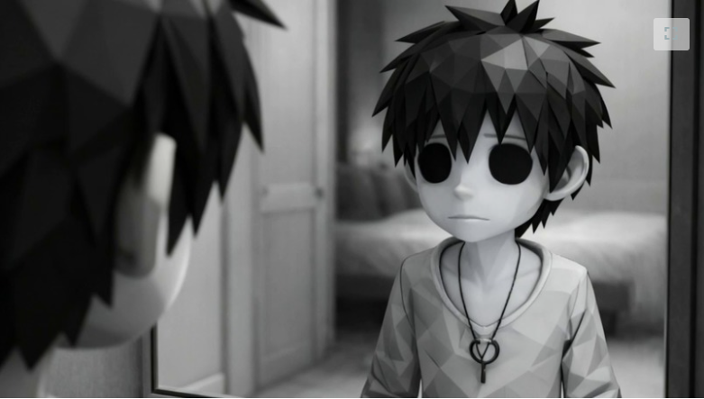

<p align="center">
  
</p>

<h1 align="center">Anedolia</h1>

<p align="center">
  <em>A narrative web game about rediscovering color in life through memories</em>
</p>

<p align="center">
  
  
  
  
  
  
</p>

<p align="center">
  <a href="#-about">About</a> •
  <a href="#-features">Features</a> •
  <a href="#-installation">Installation</a> •
  <a href="#-how-it-works">How It Works</a> •
  <a href="#-gemini-integration">Gemini Integration</a> •
  <a href="#-gameplay">Gameplay</a>
</p>

---

## 📖 About

**Anedolia** is an immersive first-person narrative experience where players navigate through a grayscale apartment, interacting with everyday objects that unlock forgotten memories. As the story unfolds, color gradually returns to the world — transforming from muted grays to soft pastels, and finally to vibrant, saturated tones — culminating in a hopeful and emotionally resonant ending.

The game explores profound themes of **emotional numbness**, **routine**, and **recovery**, drawing inspiration from acclaimed titles like **LIMBO**, **INSIDE**, and **Journey**. What makes Anedolia unique is that all narrative content — internal monologues, memory descriptions, and the final emotional message — is **dynamically generated by Google's Gemini API**, ensuring each playthrough feels personal and distinct.

**Built for the Google Gemini API Developer Competition.**

### 🎯 Core Themes
- 🧠 **Mental Health** — Exploring depression and emotional detachment
- 🔄 **Routine & Monotony** — The weight of living on autopilot
- 💡 **Awareness** — Rediscovering meaning through small moments
- 🌈 **Hope** — Visual metaphor of color returning to life

---

## ✨ Features

### 🎮 Gameplay
- **Immersive 3D Environment** — Fully explorable apartment with realistic physics
- **Third-Person Camera** — Smooth, cinematic camera controls
- **Interactive Objects** — 5+ meaningful objects with unique narratives
- **Progressive Color System** — World transitions from grayscale to full color
- **Proximity-Based Interactions** — Context-sensitive UI prompts

### 🤖 AI-Powered Narrative
- **Dynamic Story Generation** — Unique texts created by Gemini API
- **Contextual Responses** — Poetic descriptions tailored to game themes
- **Fallback System** — Offline-ready with pre-written content
- **Multi-Stage Experience** — Intro → Wake-up → Exploration → Ending

### 🎨 Visual & Audio
- **Post-Processing Effects** — Custom shaders for color progression
- **Character Animations** — Idle, walking, sitting-to-standing sequences
- **Ambient Soundscapes** — Interaction audio feedback
- **Cinematic Sequences** — Narrative intro and emotional conclusion

### ⚡ Technical
- **WebGL-Based** — Runs directly in browser, no downloads
- **Optimized Performance** — Maintains 60fps on modern browsers
- **Responsive Design** — Works across devices
- **Server-Side API** — Secure Gemini API key handling

---


## 🚀 Tech Stack

| Category | Technologies |
|----------|-------------|
| **Framework** | Next.js 14, React 18, TypeScript |
| **3D Rendering** | React Three Fiber, Three.js, @react-three/drei |
| **Physics** | @react-three/rapier (Rapier physics engine) |
| **AI** | Google Gemini API (gemini-1.5-flash) |
| **State Management** | Zustand, React Hooks |
| **Styling** | Tailwind CSS |
| **3D Modeling** | Blender (character & environment) |
| **Animation** | GLTF animations, SkeletonUtils |

---

## 📦 Installation

### Prerequisites

Before you begin, ensure you have:

- ✅ **Node.js 18+** ([Download](https://nodejs.org/))
- ✅ **npm** or **yarn**
- ✅ **Google AI Studio API Key** ([Get it here](https://aistudio.google.com/app/apikey))

### Setup Instructions

1. **Clone the repository**
```bash
git clone https://github.com/Sofia-gith/Anedolia.git
cd Anedolia
```

2. **Install dependencies**
```bash
npm install
# or
yarn install
```

3. **Configure environment variables**

Create a `.env.local` file in the root directory:
```env
GOOGLE_API_KEY=your_gemini_api_key_here
```

> ⚠️ **Security Note:** Never commit your `.env.local` file to version control!

4. **Run the development server**
```bash
npm run dev
# or
yarn dev
```

5. **Open the game**

Navigate to [http://localhost:3000](http://localhost:3000) in your browser.

### Production Build
```bash
npm run build
npm start
```

---

## 🎯 Project Structure
```
anedolia/
├── app/
│   ├── page.tsx                      # 🎮 Main game page
│   ├── layout.tsx                    # 🏗️ Root layout
│   ├── globals.css                   # 🎨 Global styles
│   ├── api/
│   │   └── gemini-route/
│   │       └── route.ts              # 🤖 Gemini API endpoint (Server-side)
│   └── gemini/
│       └── page.tsx                  # 🧪 Gemini API testing page
│
├── components/
│   ├── Apartamento.jsx               # 🏠 3D apartment model + interactive objects
│   ├── Player3D.tsx                  # 🚶 Third-person player controller
│   ├── Player.tsx                    # 👁️ First-person player controller
│   ├── CameraThirdPerson.tsx         # 📹 Third-person camera system
│   ├── CameraZoom.tsx                # 🔍 Cinematic zoom on interactions
│   ├── InteractiveObject.tsx         # 🎯 Proximity-based interaction logic
│   ├── IntroNarrativa.tsx            # 📖 Narrative intro sequence
│   ├── WakeUpSequence.tsx            # 🛏️ Character wake-up animation
│   ├── EndGameSequence.tsx           # 🎬 Ending cinematic sequence
│   ├── GeminiTextDisplay.tsx         # 💬 UI for Gemini-generated text
│   ├── GenGemini.tsx                 # 🧠 Gemini content manager (Context)
│   ├── Book.tsx                      # 📚 3D book model component
│   ├── PictureFrame.tsx              # 🖼️ 3D picture frame component
│   │
│   ├── effects/
│   │   └── AnedoliaEffects.tsx       # 🌈 Post-processing (grayscale → color)
│   │
│   ├── interaction/
│   │   ├── ApartamentoComInteracao.jsx   # 🏠 Apartment with interaction system
│   │   ├── InteractableObject.tsx        # 🎯 Object interaction + zoom logic
│   │   └── useInteraction.tsx            # 📦 Zustand store for interactions
│   │
│   └── ui/
│       └── InteractionPrompt.tsx     # 💡 "Press E to interact" UI
│
├── config/
│   └── env.ts                        # ⚙️ Environment variable validation
│
├── public/
│   ├── *.glb                         # 🎨 3D models (apartment, character, objects)
│   ├── models/                       # 👤 Character animation models
│   ├── songs/                        # 🎵 Interaction audio files
│   ├── intro/                        # 🎬 Intro sequence images
│   ├── endGame/                      # 🏁 End game assets
│   └── images/                       # 🖼️ UI and object images
│
├── .env.local                        # 🔐 Environment variables (not in repo)
├── .env.example                      # 📝 Example environment file
├── package.json                      # 📦 Dependencies
├── tsconfig.json                     # ⚙️ TypeScript configuration
└── README.md                         # 📖 You are here!
```

---

## 🎮 Game Design

### Core Concept

Players wake up in a **monochromatic world**, experiencing the emotional weight of routine and numbness. Through exploration and interaction with meaningful objects, they gradually **restore color** to their surroundings — a metaphor for rediscovering awareness, presence, and emotional connection.


### Interactive Objects

Each object has unique significance:

| Object | Theme | Color Progress |
|--------|-------|----------------|
| ☕ **Coffee Machine** | Morning rituals, warmth | +10% |
| 🌿 **Plant** | Growth, persistence | +15% |
| 📚 **Books** | Knowledge, memories | +20% |
| 🪞 **Mirror** | Self-reflection | +25% |
| 🖼️ **Painting** | Creativity, expression | +30% |

### Controls

| Input | Action |
|-------|--------|
| **W A S D** | Move character |
| **Mouse** | Look around / Rotate camera |
| **E** | Interact with nearby objects |
| **Space** | Run (during gameplay) / Advance (during intro) |
| **Click** | Lock pointer (for camera control) |

---

## 🔧 How It Works

### 1. **Game State Management**

The game progresses through distinct states:
```typescript
type GameState = 
  | "intro"           // Narrative slideshow
  | "waking_up"       // Character on bed
  | "standing_up"     // Stand-up animation
  | "playing";        // Free exploration
```

State transitions are managed via React hooks and triggered by player actions (SPACE key) or animation completion.

### 2. **Physics & Collision**

- **Player**: Capsule collider (prevents clipping through walls)
- **Environment**: Trimesh colliders (precise collision with apartment geometry)
- **Movement**: Physics-based with lerp smoothing for natural feel

### 3. **Camera System**

**Third-Person Camera:**
- Orbits around player using yaw/pitch angles
- Pointer lock API for mouse control
- Smooth lerp interpolation prevents jarring movements
- Distance and height dynamically adjust

**Zoom System:**
- Temporarily overrides player control during interactions
- Cinematic transition to focus on objects
- Easing functions (ease-in-out cubic) for smooth animation

### 4. **Color Progression Shader**

Custom post-processing effect that interpolates between grayscale and color:
```javascript
// Simplified concept
mix(grayscale(pixel), originalColor(pixel), colorProgress)
```

As `colorProgress` increases (0.0 → 1.0), the world transitions from gray to vibrant.

### 5. **Animation System**

Uses **SkeletonUtils** to clone skeletal animations independently:

- **Idle** — Character standing still
- **Walk** — Forward movement
- **WalkBack** — Backward movement
- **Sit-to-Stand** — Wake-up sequence

Each animation has individual scale/offset parameters to maintain visual consistency.

---

## 🤖 Gemini Integration

### Architecture
```
Player Interaction → Proximity Detection → Display Prompt
                              ↓
                     Player Presses 'E'
                              ↓
                    Request Gemini Text
                              ↓
              /api/gemini-route (Server-Side)
                              ↓
                  Gemini API Call (gemini-1.5-flash)
                              ↓
                     Parse CSV Response
                              ↓
               Store in React Context (GenGemini)
                              ↓
           Display Text + Image (GeminiTextDisplay)
                              ↓
                    Update Color Progress
```

### API Implementation

**Server-Side Endpoint** (`/api/gemini-route/route.ts`):
```typescript
import { GoogleGenerativeAI } from "@google/generative-ai";

export async function GET() {
  const genAI = new GoogleGenerativeAI(process.env.GOOGLE_API_KEY!);
  const model = genAI.getGenerativeModel({ model: "gemini-1.5-flash" });
  
  const prompt = `
    Generate poetic, introspective descriptions for 5 objects.
    Format: CSV (objeto,texto)
    Themes: routine, emotional numbness, rediscovery
    Tone: melancholic yet hopeful
    Length: 15-25 words each
    
    Objects: café, planta, livros, espelho, quadro
  `;
  
  const result = await model.generateContent(prompt);
  const text = result.response.text();
  
  return Response.json({ text });
}
```

**Client-Side Context** (`GenGemini.tsx`):
```typescript
const [texts, setTexts] = useState<Record<string, string>>(FALLBACKS);

useEffect(() => {
  fetch('/api/gemini-route')
    .then(res => res.json())
    .then(data => {
      const parsed = parseCSV(data.text);
      setTexts({ ...FALLBACKS, ...parsed });
    })
    .catch(() => setTexts(FALLBACKS)); // Fallback on error
}, []);
```

### Why Gemini?

- ✅ **Dynamic Content** — Each playthrough feels unique
- ✅ **Thematic Consistency** — Structured prompts ensure tone alignment
- ✅ **Creative Variability** — AI generates poetic, nuanced descriptions
- ✅ **Scalability** — Easy to expand with more objects/interactions

### Example Output

**Prompt for Coffee Machine:**
```csv
café,The aroma of coffee fills the air, bringing back memories of mornings warmed by hope.
```

**Prompt for Plant:**
```csv
planta,The plant by the window persists, even without sun. Its leaves seek light, as if hope slowly sprouts.
```

---

## 🐛 Troubleshooting

### Common Issues

**❌ Game doesn't load / Black screen**
- Check browser console (F12) for errors
- Ensure WebGL is supported: Visit [webglreport.com](https://webglreport.com)
- Try disabling browser extensions (especially ad blockers)

**❌ Gemini API returns errors**
- Verify API key is correct in `.env.local`
- Check API quota at [Google AI Studio](https://aistudio.google.com)
- Ensure `.env.local` file exists in root directory

**❌ Character/Camera behaves strangely**
- Refresh the page (F5)
- Clear browser cache
- Try incognito/private browsing mode

**❌ Poor performance / Low FPS**
- Close other tabs/applications
- Lower browser zoom to 100%
- Disable browser hardware acceleration (ironically helps some GPUs)

### Browser Compatibility

| Browser | Support |
|---------|---------|
| Chrome 90+ | ✅ Recommended |
| Firefox 88+ | ✅ Supported |
| Edge 90+ | ✅ Supported |
| Safari 14+ | ⚠️ Limited (WebGL quirks) |
| Mobile | ⚠️ Experimental |

---

## 🛣️ Roadmap

### Planned Features

- [ ] 🎵 **Dynamic Music** — Adaptive soundtrack based on color progress
- [ ] 🌍 **Multiple Environments** — Additional rooms/locations
- [ ] 📱 **Mobile Optimization** — Touch controls and performance
- [ ] 🎨 **Custom Shaders** — More advanced visual effects
- [ ] 🗣️ **Voice Acting** — Optional narration
- [ ] 💾 **Save System** — LocalStorage-based progress saving
- [ ] 🏆 **Achievements** — Hidden collectibles and easter eggs
- [ ] 🌐 **Localization** — Multi-language support

### Known Limitations

- 📱 Mobile touch controls not fully implemented
- 🎮 Gamepad support not available
- 💾 No persistent save system (session-only)
- 🌐 Requires internet for Gemini API (fallback available)

---

## 🤝 Contributing

Contributions are welcome! If you'd like to improve Anedolia:

1. Fork the repository
2. Create a feature branch (`git checkout -b feature/amazing-feature`)
3. Commit your changes (`git commit -m 'Add amazing feature'`)
4. Push to the branch (`git push origin feature/amazing-feature`)
5. Open a Pull Request

### Development Guidelines

- Follow existing code style (TypeScript + Prettier)
- Test on multiple browsers before submitting
- Document new features in README
- Keep commits atomic and descriptive

---

## 📄 License

This project is licensed under the **MIT License** — see [LICENSE](LICENSE) file for details.

You are free to:
- ✅ Use commercially
- ✅ Modify and distribute
- ✅ Use privately

---

## 👥 Authors

<table>
  <tr>
    <td align="center">
      <a href="https://github.com/Sofia-gith">
        <br />
        <sub><b>Sofia Floriano</b></sub>
      </a><br />
      <sub>Lead Developer</sub>
    </td>
    <td align="center">
      <a href="https://github.com/israelsouza">
        <br />
        <sub><b>Israel Souza</b></sub>
      </a><br />
      <sub>Co-Developer</sub>
    </td>
  </tr>
</table>

---

## 🙏 Acknowledgments

- **Google DeepMind** — For the Gemini API Developer Competition
- **Game Inspirations** — INSIDE, LIMBO, Journey, Gris
- **Communities** — Three.js, React Three Fiber, Next.js
- **Asset Creators** — See [Credits](#credits) section

---

## 🎨 Credits

### 3D Models

**Apartment Model:**
```
Auto-generated by: https://github.com/pmndrs/gltfjsx
Command: npx gltfjsx@6.5.3 public/home/apartamento.glb --typescript
Author: SrMonteiro (https://sketchfab.com/crispimrafael)
License: CC-BY-4.0 (http://creativecommons.org/licenses/by/4.0/)
Source: https://sketchfab.com/3d-models/apartamento-77e965e2d3244bd58c476ca96baf387e
Title: Apartamento
```

**Character Model:**
- Created in Blender by Sofia Floriano
- Original design for Anedolia

### Tools & Libraries

- [Next.js](https://nextjs.org/) - React framework
- [Three.js](https://threejs.org/) - 3D graphics library
- [React Three Fiber](https://docs.pmnd.rs/react-three-fiber/) - React renderer for Three.js
- [Rapier](https://rapier.rs/) - Physics engine
- [Google Gemini](https://deepmind.google/technologies/gemini/) - AI narrative generation
- [Blender](https://www.blender.org/) - 3D modeling software

---


##simplified diagram(ASCII)

┌─────────────────────────────────────────────────────────────┐
│                         Page.tsx                             │
│  ┌────────────┐  ┌──────────────┐  ┌──────────────────┐    │
│  │ GameState  │  │ ColorProgress│  │ InteractedObjects│    │
│  └────────────┘  └──────────────┘  └──────────────────┘    │
└─────────────────────┬───────────────────────────────────────┘
│
┌─────────────┼─────────────┐
│             │             │
▼             ▼             ▼
┌──────────────┐ ┌────────┐ ┌─────────────┐
│ IntroNarra   │ │ Scene  │ │ GenGemini   │
│  tiva        │ │        │ │ (Context)   │
└──────────────┘ └────┬───┘ └──────┬──────┘
│            │
┌─────────────┼────────┐   │
│             │        │   │
▼             ▼        ▼   ▼
┌──────────────┐ ┌────────────────────┐ ┌─────────────┐
│ Player3D     │ │ Apartamento        │ │ Gemini      │
│              │ │                    │ │ TextDisplay │
│ ┌──────────┐ │ │ ┌────────────────┐│ └─────────────┘
│ │AnimState │ │ │ │Interactive     ││
│ └──────────┘ │ │ │Object (x5)     ││
└──────┬───────┘ │ └────────┬───────┘│
│         └──────────┼────────┘
│                    │
└────────┬───────────┘
│
▼
┌───────────────┐
│ Interaction   │
│ Store         │
│ (Zustand)     │
│               │
│ ┌───────────┐ │
│ │ZoomState  │ │
│ └───────────┘ │
└───────┬───────┘
│
┌───────────┼───────────┐
▼           ▼           ▼
┌────────┐ ┌─────────┐ ┌──────────┐
│Camera  │ │Camera   │ │Anedolia  │
│Third   │ │Zoom     │ │Effects   │
│Person  │ │         │ │          │
└────────┘ └─────────┘ └──────────┘

----

<p align="center">
  <strong>Built with ❤️ for the Google Gemini API Developer Competition</strong>
</p>

<p align="center">
  <a href="https://anedolia.vercel.app">🎮 Play Now</a> •
  <a href="https://github.com/Sofia-gith/Anedolia/issues">🐛 Report Bug</a> •
  <a href="https://github.com/Sofia-gith/Anedolia/issues">💡 Request Feature</a>
</p>